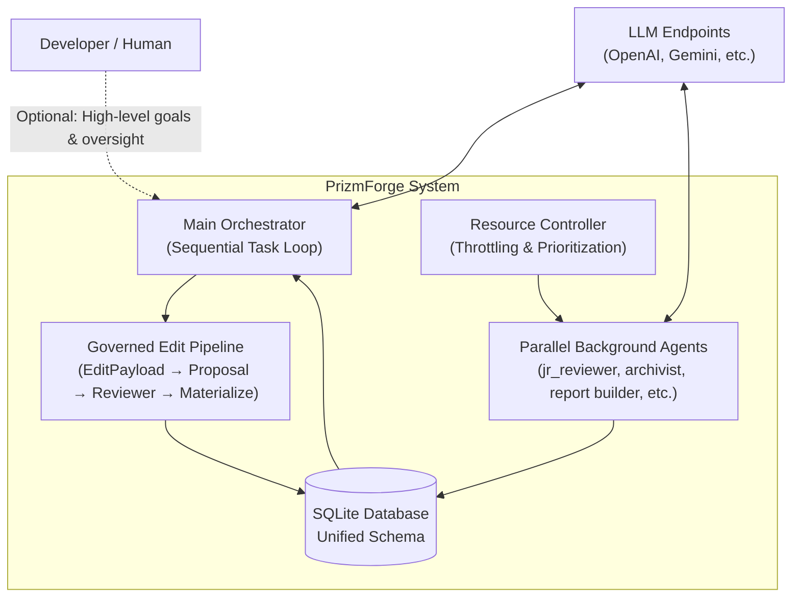
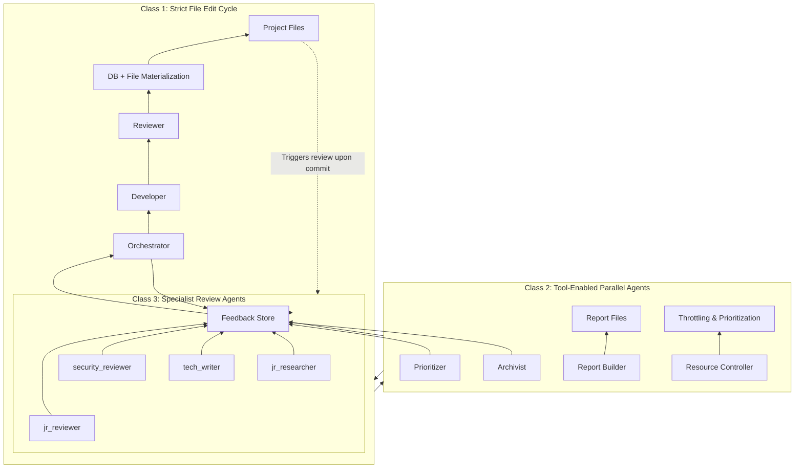

# PrizmForge

**Autonomous multi-agent software engineering system with governed self-editing.**

PrizmForge enables AI agents to safely modify a project repository, even a copy of their own codebase through a structured proposal and review process, while maintaining full auditability and human oversight.

## Core Philosophy

PrizmForge solves the fundamental problem of **safe autonomous code modification** by enforcing a strict separation between:

- **Mutation path** (sequential, governed): Developer → Proposal → Reviewer gate → Materialization
- **Analysis path** (parallel): Background agents provide continuous feedback without mutation rights

## Architecture

### System Architecture Diagram



### Agent Classes



## Current File Editing Methodology (Governed Editing)

PrizmForge no longer uses traditional diffs or patches. Instead, it uses a **line-level governed editing system**:

### Key Concepts

- **Line GUIDs**: Every line in a governed file has a stable UUID (`line_guid`) + `sort_order` (REAL). This enables precise insertions, deletions, and replacements without relying on line numbers.
- **EditPayload**: Structured operations (`replace_block`, `insert_after`, `delete_lines`, etc.) validated by Pydantic.
- **Proposal**: A formal request containing the `EditPayload`, expected content hashes, and affected line GUIDs.
- **Optimistic Concurrency**: Proposals capture content hashes at creation time. If the file changes before application, the proposal is rejected as `conflicted`.
- **Reviewer Gate**: All proposals must be reviewed (by an agent or human) before materialization.
- **Materialization**: Only approved proposals are applied via `apply_edit_proposal()`.

### Editing Flow

```
Developer Agent
      │
      ▼
EditPayload (structured operations)
      │
      ▼
create_proposal_from_developer_output()
      │
      ▼
Proposal stored with expected_hashes + affected_line_guids
      │
      ▼
Reviewer Agent (or human) reviews
      │
      ▼
Status → approved / rejected
      │
      ▼
apply_edit_proposal(proposal_id)
      │
      ▼
validate_proposal() → hash check
      │
      ▼
Materialize changes to file_lines table
      │
      ▼
(Optional) writer.py → disk
```

This approach provides:
- Precise, stable edits even as files change
- Strong protection against concurrent modification
- Full audit trail of every proposed change
- Clear separation of proposal creation and application

## Key Safety Features

- Line-level optimistic concurrency via content hashes
- Strict Pydantic validation on all edit operations
- Reviewer safety gate before any mutation
- Post-write invalidation of overlapping proposals
- Comprehensive error logging and proposal status tracking

## Testing

The project includes a growing test suite focused on:

- Governed editing logic and edge cases
- Schema initialization
- JSON parsing and truncation detection
- Token estimation and budgeting
- Resource Controller data structures and logic
- Endpoint Manager, Proposal Builder, Task Runner, Agent Execution, and Parallel Workers (including race conditions)

Run tests with:

```bash
pytest tests/ -q
```

## Getting Started

1. Ensure Python 3.12+
2. Install dependencies (see `requirements.txt` or equivalent)
3. Initialize the database:

```bash
python -c "from core.db import init_db; init_db()"
```

4. Start in interactive mode:

```bash
python interactive.py
```

## Project Status

PrizmForge is under active development. The governed editing system represents the current production methodology for safe autonomous modifications.

For detailed architecture, see `architecture.md`.

## License

MIT
See repository for license information.
