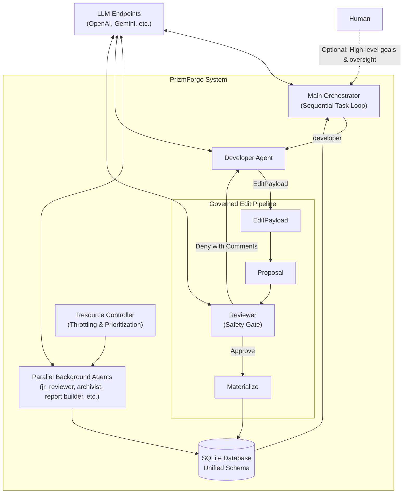
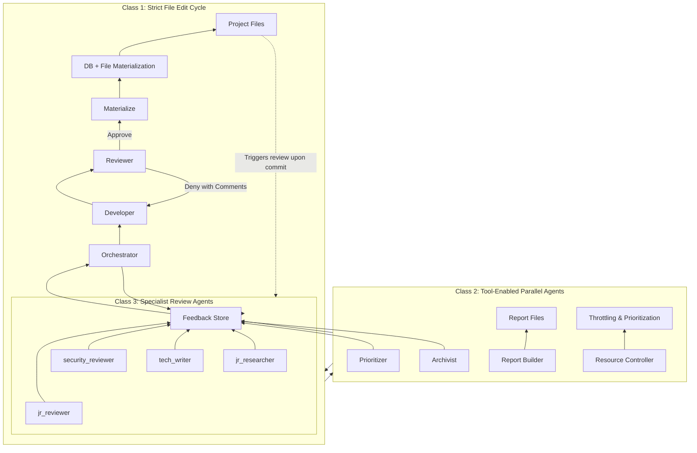

# PrizmForge

**Autonomous multi-agent software engineering system with governed self-editing.**

PrizmForge enables AI agents to safely modify a project repository, even a copy of their own codebase through a structured proposal and review process, while maintaining full auditability and human oversight.

## Core Philosophy

"AI makes coding cheaper, and Judgement more valuble." Proffesor Todd Whitaker May 2026

PrizmForge solves the fundamental problem of **safe autonomous code modification** by enforcing a strict separation between:

- **Mutation path** (sequential, governed): Developer → EditPayload → Proposal → Reviewer (Approve → Materialization | Deny with Comments → Developer)
- **Analysis path** (parallel): Background agents provide continuous feedback without mutation rights

## Quick Start

```bash
# 1. Bootstrap a local virtual environment and install dependencies
./utils/setup.sh

# 2. Activate the environment
source .venv/bin/activate          # Linux / macOS
# .venv\Scripts\activate           # Windows

# 3. Copy configuration templates (if needed)
cp example_config.json config.json
cp example_api_key.json api_key.json   # add real keys, or use llm.test_mode

# 4. Run
python main.py
```

`utils/setup.sh` creates (or reuses) a project-root `.venv` and installs both runtime (`requirements.txt`) and development (`requirements-dev.txt`) dependencies. Use `--force` to recreate the venv or `--python /path/to/python` to select a specific interpreter.

For detailed configuration options see **[CONFIGURATION.md](CONFIGURATION.md)**.  
For the test suite see **[tests/README.md](tests/README.md)** (and the architectural context in **[tests/LLM_CONTEXT.md](tests/LLM_CONTEXT.md)**).

## Architecture

### System Architecture Diagram


```mermaid
flowchart TB
    subgraph PrizmForge["PrizmForge System"]
        direction TB

        MainOrch["Main Orchestrator\n(Sequential Task Loop)"]
        
        subgraph Governed["Governed Edit Pipeline"]
            direction TB
            EditPayload["EditPayload"]
            Proposal["Proposal"]
            Reviewer["Reviewer\n(Safety Gate)"]
            Materialize["Materialize"]
            
            EditPayload --> Proposal --> Reviewer
            Reviewer -->|Approve| Materialize
        end
        
        DeveloperAgent["Developer Agent"]
        Parallel["Parallel Background Agents\n(jr_reviewer, archivist, report builder, etc.)"]
        Resource["Resource Controller\n(Throttling & Prioritization)"]
        DB[(SQLite Database\nUnified Schema)]

        MainOrch -->|developer| DeveloperAgent
        DeveloperAgent -->|EditPayload| EditPayload
        Materialize --> DB
        Parallel --> DB
        Resource --> Parallel
        
        %% Autonomous loop - Orchestrator reads proposals/tasks from DB (unattended mode)
        DB --> MainOrch
    end

    Human["Human"] -.->|Optional: High-level goals & oversight| MainOrch
    Reviewer -->|Deny with Comments| DeveloperAgent
    LLM["LLM Endpoints\n(OpenAI, Gemini, etc.)"] <--> MainOrch
    LLM <--> Parallel
    LLM <--> DeveloperAgent
    LLM <--> Reviewer
```

### Agent Classes


```mermaid
flowchart BT
    subgraph Class3["Class 3: Specialist Review Agents"]
        direction TB
        JrReviewer["jr_reviewer"]
        Security["security_reviewer"]
        TechWriter["tech_writer"]
        JrResearcher["jr_researcher"]

        JrReviewer --> Feedback["Feedback Store"]
        Security --> Feedback
        TechWriter --> Feedback
        JrResearcher --> Feedback
    end

    subgraph Class2["Class 2: Tool-Enabled Parallel Agents"]
        direction TB
        Prioritizer["Prioritizer"]
        Archivist["Archivist"]
        ReportBuilder["Report Builder"]
        ResourceCtrl["Resource Controller"]

        Prioritizer --> Feedback
        Archivist --> Feedback
        ReportBuilder --> Reports["Report Files"]
        ResourceCtrl --> Throttling["Throttling & Prioritization"]
    end

    subgraph Class1["Class 1: Strict File Edit Cycle"]
        direction TB
        Orchestrator["Orchestrator"]
        Developer["Developer"]
        Reviewer["Reviewer"]
        Materialize["Materialize"]
        DBMat["DB + File Materialization"]

        Orchestrator --> Feedback
        Orchestrator --> Developer
        Developer --> Reviewer
        Reviewer -->|Approve| Materialize
        Reviewer -->|Deny with Comments| Developer
        Materialize --> DBMat
        DBMat --> Files["Project Files"]

        Files -.->|Triggers review upon commit| Class3
    end

    Feedback --> Orchestrator
    Class3 --> Feedback
    Class2 --> Feedback

    Class2 --> Class1
    Class1 --> Class2

    Reports["Report Files"]
    Throttling["Throttling & Prioritization"]
```

## Current File Editing Methodology (Governed Editing)

PrizmForge no longer uses traditional diffs or patches. Instead, it uses a **line-level governed editing system**:

### Key Concepts

- **Line GUIDs**: Every line in a governed file has a stable UUID (`line_guid`) + `sort_order` (REAL). This enables precise insertions, deletions, and replacements without relying on line numbers.
- **EditPayload**: Structured operations (`replace_block`, `insert_after`, `delete_lines`, etc.) validated by Pydantic.
- **Proposal**: A formal request containing the `EditPayload`, expected content hashes, and affected line GUIDs.
- **Optimistic Concurrency**: Proposals capture content hashes at creation time. If the file changes before application, the proposal is rejected as `conflicted`.
- **Reviewer Gate**: All proposals must be reviewed (by an agent or human) before materialization. On denial the Reviewer returns comments that are fed directly back to the Developer Agent.
- **Materialization**: Only approved proposals are applied via `apply_edit_proposal()`.

### Editing Flow

```
Developer Agent
      │
      ▼
EditPayload (structured operations)
      │
      ▼
create_proposal_from_developer_output()
      │
      ▼
Proposal stored with expected_hashes + affected_line_guids
      │
      ▼
Reviewer Agent (or human) reviews
      │
      ├── APPROVE ──► apply_edit_proposal(proposal_id)
      │                    │
      │                    ▼
      │               validate_proposal() → hash check
      │                    │
      │                    ▼
      │               Materialize changes to file_lines table
      │                    │
      │                    ▼
      │               (Optional) writer.py → disk
      │
      └── DENY with Comments ──► Developer Agent
```

This approach provides:
- Precise, stable edits even as files change
- Strong protection against concurrent modification
- Full audit trail of every proposed change
- Clear separation of proposal creation and application
- Direct feedback loop from Reviewer to Developer on rejection

## Key Safety Features

- Line-level optimistic concurrency via content hashes
- Strict validation on all edit operations
- Reviewer safety gate before any mutation
- Post-write invalidation of overlapping proposals
- Path containment under project dir and **repo root**
- **Binary payload rejection** (`core/content_safety.py`): PE/MSI/OLE magic, NUL bytes; blocks `.msi`/`.exe`/`.dll` paths — **does not** block text scripts (`.ps1`, `.bat`, `.cmd`, `.js`, ...)
- Comprehensive error logging, proposal status tracking, and mutation event log


## Governed editing notes

### `create_file` operation
New files are created only through the governed pipeline (not ad-hoc disk writes):

```text
Developer JSON { "type": "create_file", "target_file_path", "initial_content" }
  → proposal → reviewer APPROVE → apply_create_file → materialize_proposal
```

- Refuses if the path already has governed lines (use `full_replace` to overwrite).
- Documented in `agent_schemas/developer.json` and the developer system prompt.

### Project directory / repo root
- `project_directory` may be **created** on init (`ensure_project_directory`).
- Resolved project paths must stay **under the repository root** (directory containing `config.json`).
- Path containment also applies on every `write_file_to_disk`.

### Mutation event log
Thin append-only log (`events` table) via `core.events.publish_event` / `list_events`.
Emitted for proposal create/approve/reject, edit materialize/fail/fallback, and undo.
Not a full worker event bus.

### Binary content rejection
LLMs under `full_replace` may emit installers or PE blobs (e.g. Windows MSI) instead of source.
`core.content_safety.validate_source_content` is enforced on `full_replace`, `create_file`, and `write_file_to_disk`:

- **Reject:** binary magic (PE/`MZ`, ELF, OLE/CFB used by MSI, Mach-O), NUL-heavy payloads, binary-only extensions (`.msi`, `.exe`, `.dll`, ...)
- **Allow:** normal text source, including PowerShell/batch/JS scripts (`.ps1`, `.bat`, `.cmd`, `.js`)

Optional `config.json` overrides (defaults are safe/fail-closed):

```json
"content_safety": {
  "disallow_binary_content": true,
  "blocked_extensions": []
}
```

- `disallow_binary_content` (default `true`) — reject PE/MSI/OLE magic, NULs, high non-text ratio
- `blocked_extensions` (default `[]`) — allow-list of otherwise-blocked path suffixes (e.g. `[".msi"]`). Empty means no binary extensions are enabled.

See `example_config.json` for the full catalog and `tests/unit/test_content_safety.py`.

### Proposal undo
```python
from file_editing.undo import undo_proposal

undo_proposal("<proposal_id>")  # restores pre-apply snapshot; explicit id required
```
Snapshots are taken automatically in `run_developer_mutation` before materialize.

## Dependencies

Designed for **Advana Nexus / SageMaker**-friendly installs (popular DS/DE packages).

| File | Purpose |
|------|---------|
| `requirements.txt` | **Runtime only:** `requests>=2.31.0` |
| `requirements-dev.txt` | Tests: `pytest`, `pytest-mock`. Optional: `black`, `isort`, `ruff`, `mypy` |

```bash
# Preferred: one-command bootstrap (creates .venv + installs both files)
./utils/setup.sh

# Manual alternative
pip install -r requirements.txt          # runtime
pip install -r requirements-dev.txt      # development / CI
```

LLM calls in tests use a **stdlib MockLLM** (`tests/mocks/openai.py`) — no OpenAI SDK, no network.

The **CLI** (`python interactive.py` / `python main.py`) is the supported user interface — there is no graphical UI.

## Testing

Full operational details, assertion rules, pure-suite inventory, and preferred runners live in **[tests/README.md](tests/README.md)**.  
Architectural context, gap analysis, and multi-platform notes live in **[tests/LLM_CONTEXT.md](tests/LLM_CONTEXT.md)**.

```bash
# Preferred CI / local normal gate
./utils/run_tests.sh --normal -j 4

# Full suite (host-aware)
./utils/run_tests.sh --full --batched

# Slow / concurrent worker stress
pytest tests/ -m slow -q

# Ultra-minimal host (no pytest)
python -m utils.run_critical_tests

# Optional real-model smoke (requires keys / network)
python -m utils.smoke_real_model
```

High-priority pure modules that gate the governed edit path are listed in `tests/README.md` (PR #67 coverage).

## Compliance & authorization

Program RMF / Navy RAISE / DISA ASD STIG-oriented requirements and artifact expectations: **[COMPLIANCE.md](COMPLIANCE.md)**.


## Project export & indexes

| Script | Purpose |
|--------|---------|
| **`utils/consolidate.py`** | Build `report/INDEX.md`, split indexes, and optional full `project_review.md`. Each file starts with `Generated: <UTC>`. |
| **`utils/export_project_zip.py`** | Run consolidate, then zip the project (including `report/`) next to the project directory. |

```bash
# Indexes + full review under report/
python utils/consolidate.py

# Indexes only
python utils/consolidate.py --indexes-only

# Consolidate then create ../PrizmForge-multi-agent.zip
python utils/export_project_zip.py

# Zip without regenerating report/
python utils/export_project_zip.py --skip-consolidate
```

Does **not** run tests. For the normal gate use `./utils/run_tests.sh --normal -j 4`.


## Configuration

See **[CONFIGURATION.md](CONFIGURATION.md)** for the full `config.json` schema. Template: `example_config.json`.


## CLI usage examples

Primary entrypoint is **`python main.py`** (mode comes from `config.json` → `cli_mode.mode`).  
Semi-attended sessions also accept typed commands (see help inside the session).

### First-time setup (detailed)

```bash
# Preferred bootstrap
./utils/setup.sh
source .venv/bin/activate

# Copy templates if needed
cp example_config.json config.json
cp example_api_key.json api_key.json   # then put real keys (or use llm.test_mode)

python main.py                         # loads config, init_db, optional auto-init, starts CLI mode
```

### Unattended (config only, no stdin)

```json
"cli_mode": { "mode": "unattended", "unattended": { "seed_task": "...", "max_duration_hours": 2 } },
"llm": { "test_mode": true }
```

```bash
python main.py
# Optional DB override (prefer project path, not /tmp for real runs):
# PRIZMFORGE_DB_PATH=./ExampleProject/.PrizmForge/agents.db python main.py
```

### Semi-attended / interactive commands

After `python main.py` with `cli_mode.mode` = `semi_attended` (or `python interactive.py`):

```text
init                 Scan and index project_directory into the DB + symbol index
files                List indexed files
status               Token budget status
history [N]          Recent tasks
feedback <task_id>   Unaddressed feedback for a task
endpoints            Configured LLM endpoints
health               Endpoint health
reports              List generated reports
report [name]        Show latest or named report
resource_status      Resource controller status
review_status        Background agent activity
help                 Full command list
<natural language>   Start a new task description
```

### Utilities (from repo root)

```bash
# Structural indexes + optional full review → report/
python utils/consolidate.py
python utils/consolidate.py --indexes-only
python utils/consolidate.py --target --indexes-only   # target project_directory

# Package project (runs consolidate, includes report/)
python utils/export_project_zip.py
python utils/export_project_zip.py --skip-consolidate
python utils/export_project_zip.py --out /path/to/out.zip

# Tests (see tests/README.md for full details)
./utils/run_tests.sh --normal -j 4
pytest tests/ -m "not slow" -q
python -m utils.run_critical_tests
```

### Dry-run without API keys

```bash
# config.json: "llm": { "test_mode": true }
# or:
PRIZMFORGE_TEST_MODE=1 python main.py
```

Mock responses can be scripted under `llm.mock_responses` (string or list queue per agent). See `CONFIGURATION.md`.

## Project Status

PrizmForge is under active development. The governed editing system represents the current production methodology for safe autonomous modifications.

For detailed architecture, see **[architecture.md](architecture.md)**.

## License

MIT  
See repository for license information.
