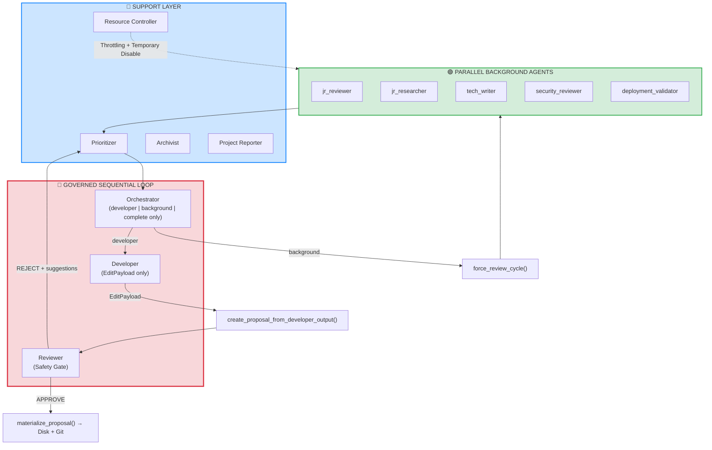
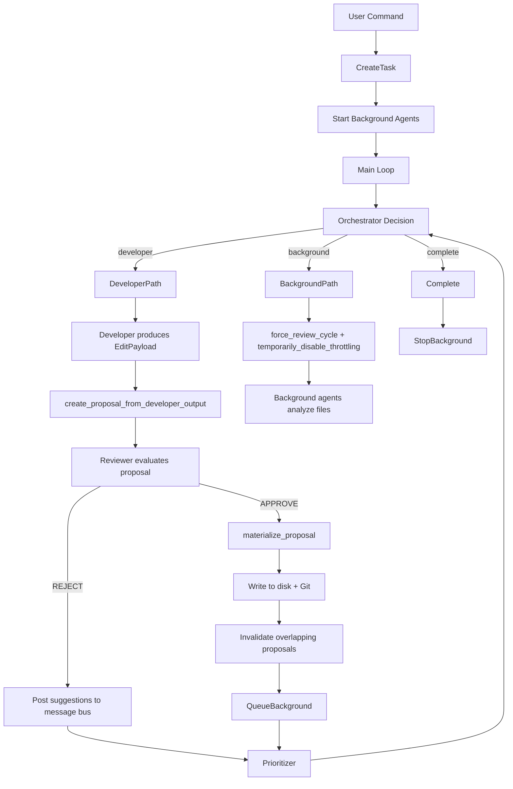

# PrizmForge Architecture

Technical details and system design documentation.

## Table of Contents

- [System Overview](#system-overview)
- [Agent Architecture](#agent-architecture)
- [Governed File Editing System](#governed-file-editing-system)
- [Database Schema](#database-schema)
- [Task Execution Flow](#task-execution-flow)
- [Multi-Endpoint System](#multi-endpoint-system)
- [Background Agent System](#background-agent-system)
- [File Operations](#file-operations)
- [Context Archival](#context-archival)
- [Message Bus](#message-bus)
- [Rate Limiting](#rate-limiting)
- [Token Budget](#token-budget)
- [Resource Controller](#resource-controller)
- [Error Handling & Observability](#error-handling--observability)
- [Performance Considerations](#performance-considerations)
- [Security Considerations](#security-considerations)

---

### System Overview

PrizmForge is a multi-agent autonomous software development system built around **safe, governed self-modification**.

The architecture is deliberately split into two layers:

- A tightly controlled **sequential loop** responsible for all code mutations.
- A **parallel background agent layer** that continuously analyzes code and generates suggestions.

All file modifications must now go through a structured, auditable path:  
**Developer → `EditPayload` → Proposal → Reviewer (safety gate) → `materialize_proposal()`**.

The legacy direct diff/patch editing path is deprecated. All modifications must go through the governed proposal system.

#### High-Level Architecture



#### Key Design Principles

**🟢 Parallel Background Agents**  
`jr_reviewer`, `jr_researcher`, `tech_writer`, `security_reviewer`, and `deployment_validator` run continuously in parallel threads. They post findings to the `prioritizer` and never directly modify files. They can be forcefully triggered via `force_review_cycle()`.

**🔵 Support Layer**  
- **Prioritizer**: Scores, deduplicates, and ranks feedback. Human input receives strong bias. Surfaces the top actionable items to the orchestrator.
- **Resource Controller**: Monitors token usage and API rate limits. Applies progressive throttling and supports temporary disabling during forced review cycles.
- **Archivist**: Compresses old messages while preserving key decisions.

**🔴 Governed Sequential Loop (Critical Mutation Path)**  
This is now the **only** supported path for modifying files:
- `orchestrator` may only return `developer`, `background`, or `complete`.
- `developer` must output a structured `EditPayload`.
- A proposal is created and sent to the `reviewer`.
- The `reviewer` acts as a strict safety gate (JSON decision).
- Only approved proposals are materialized to disk.

**👤 Human as First-Class Agent**  
Human input is posted to the message bus with `priority="CRITICAL"` and receives strong bias in the prioritizer.

#### Data Flow (Updated)

```
Background Agents → Prioritizer → Orchestrator
                                      │
                    ┌─────────────────┴─────────────────┐
                    │                                   │
              developer                           background
                    │                                   │
              EditPayload → Proposal → Reviewer    force_review_cycle()
                    │                                   │
              materialize_proposal()              Parallel Agents
                    │                                   │
              Disk + Git                          Prioritizer
```

---

### Agent Architecture

#### Agent Categories

PrizmForge now clearly separates agents into two categories:

| Category              | Agents                                      | Can Mutate Files? | Invocation                  | Notes |
|-----------------------|---------------------------------------------|-------------------|-----------------------------|-------|
| **Sequential (Governed)** | `orchestrator`, `developer`, `reviewer`    | Indirect (via proposal) | Main task loop             | Critical path only |
| **Parallel Background**   | `jr_reviewer`, `jr_researcher`, `tech_writer`, `security_reviewer`, `deployment_validator` | No | Background worker pool     | Continuous analysis |
| **Support**               | `prioritizer`, `resource_controller`, `archivist`, `project_reporter` | No | Event-driven / Scheduled   | Infrastructure |

#### Sequential Agents (Governed Loop)

- **Orchestrator**  
  Role: High-level decision maker.  
  **Constraint**: May only return `next_agent` as `developer`, `background`, or `complete`. It must never directly call `reviewer` or `researcher`.

- **Developer**  
  Role: Primary code author.  
  **Constraint**: Must output changes using the structured `EditPayload` format. Raw diffs are no longer accepted in the primary path.

- **Reviewer**  
  Role: Safety gate for all proposed edits.  
  Returns strict JSON (`APPROVE` / `REJECT` + optional suggestions). Suggestions are posted to the message bus regardless of decision.

#### Background Agents

These agents run in parallel and feed the `prioritizer`:

- `jr_reviewer` — Fast code review for bugs and issues.
- `jr_researcher` — Identifies improvement opportunities and better patterns.
- `tech_writer` — Assesses and suggests documentation improvements.
- `security_reviewer` — Focuses exclusively on security vulnerabilities.
- `deployment_validator` — Validates changes after they are written to disk.

---

### Governed File Editing System

This is the **primary and recommended** mechanism for all code modifications.

#### Overview

The governed editing system replaces fragile diff/patch operations with a structured, database-backed, reviewer-gated workflow.

**Core Flow:**
1. Developer outputs a structured `EditPayload` (JSON).
2. `create_proposal_from_developer_output()` creates a persisted proposal containing:
   - The full `EditPayload`
   - `affected_line_guids`
   - `expected_hashes` (for optimistic concurrency)
3. The proposal enters `pending` → `under_review` → `approved` / `rejected` lifecycle.
4. On `APPROVE`, `materialize_proposal()` applies the changes using GUID-based operations.
5. After a successful write, overlapping pending proposals are marked `needs_revalidation`.

#### Key Technical Components

| Component                        | Location                              | Responsibility |
|----------------------------------|---------------------------------------|----------------|
| `EditPayload`                    | `file_editing/edit_payload.py`        | Pydantic models for structured operations |
| Core Editing Engine              | `file_editing/editing.py`             | GUID validation, `apply_replace_block`, `apply_insert_after`, `apply_delete_lines`, sort_order management |
| Proposal Builder                 | `workflow/proposal_builder.py`        | Converts Developer output into tracked proposals + hash capture |
| Materialization                  | `file_editing/writer.py`              | Atomic write to disk + post-write invalidation |
| Database Schema                  | `core/db.py` (consolidated)           | `files`, `file_lines`, `edit_proposals`, `file_documentation`, + core tables |

#### Line-Level Storage

Source code is stored line-by-line in the `file_lines` table:

- Every line has a stable `line_guid` (UUID).
- Ordering is maintained via `sort_order` (REAL) to support stable insertions.
- `replace_block` and `delete_lines` operations use `start_line_guid` + optional `end_line_guid`.
- `insert_after` supports `after_guid = null` for new/empty files.
- Soft deletes + automatic renumbering when sort order gaps become too small.

#### Optimistic Concurrency & Safety

- Proposals capture content hashes at creation time.
- Hashes are validated before applying changes.
- After a successful materialization, any other pending proposals that touched the same lines are automatically invalidated.

**✅ Next Batch – Updated Sections**

Here are the next three sections written in a technical deep-dive style, updated to reflect the current governed editing architecture.


#### File Context Delivery
**All file content sent to any agent must be delivered as structured data containing line_guid for every line.**

Files are always retrieved from the database.
Every line includes its line_guid.
This is the only way agents can reference lines for editing.

### Database Schema

**All database tables are now defined in a single location**: `core/db.py` → `init_db()`.

The legacy `file_editing/schema.py` has been deprecated. All governed editing tables (`files`, `file_lines`, `edit_proposals`, etc.) have been consolidated into the main schema for consistency and easier testing.

The system uses a single SQLite database. The path can be overridden via the `PRIZMFORGE_DB_PATH` environment variable (especially useful during testing).

#### Governed Editing Tables

```sql
-- Files metadata and versioning
CREATE TABLE files (
    file_id INTEGER PRIMARY KEY AUTOINCREMENT,
    file_path TEXT UNIQUE NOT NULL,
    current_version INTEGER DEFAULT 1,
    is_deleted INTEGER DEFAULT 0,
    has_been_written_to_disk INTEGER DEFAULT 0,
    git_comment TEXT,
    created_at TIMESTAMP DEFAULT CURRENT_TIMESTAMP,
    updated_at TIMESTAMP DEFAULT CURRENT_TIMESTAMP
);

-- Line-level source code storage
CREATE TABLE file_lines (
    line_guid TEXT PRIMARY KEY,
    file_id INTEGER NOT NULL,
    sort_order REAL NOT NULL,
    content TEXT,
    content_hash TEXT,
    is_deleted INTEGER DEFAULT 0,
    version INTEGER DEFAULT 1,
    created_at TIMESTAMP DEFAULT CURRENT_TIMESTAMP,
    FOREIGN KEY (file_id) REFERENCES files(file_id)
);

-- Edit proposals with optimistic concurrency support
CREATE TABLE edit_proposals (
    proposal_id TEXT PRIMARY KEY,
    target_file_id INTEGER,
    target_file_path TEXT,
    edit_payload TEXT NOT NULL,
    affected_line_guids TEXT,
    expected_hashes TEXT,
    status TEXT DEFAULT 'pending',
    proposed_by_agent_id INTEGER,
    reviewed_by_agent_id INTEGER,
    rationale TEXT,
    created_at TIMESTAMP DEFAULT CURRENT_TIMESTAMP,
    reviewed_at TIMESTAMP,
    write_started_at TIMESTAMP,
    write_completed_at TIMESTAMP,
    write_start_line_guid TEXT,
    write_end_line_guid TEXT,
    FOREIGN KEY (target_file_id) REFERENCES files(file_id)
);

-- Per-file documentation
CREATE TABLE file_documentation (
    doc_id INTEGER PRIMARY KEY AUTOINCREMENT,
    file_id INTEGER NOT NULL,
    content TEXT,
    version INTEGER DEFAULT 1,
    updated_at TIMESTAMP DEFAULT CURRENT_TIMESTAMP,
    FOREIGN KEY (file_id) REFERENCES files(file_id)
);
```

#### Core System Tables

```sql
-- Inter-agent message bus
CREATE TABLE messages (
    id INTEGER PRIMARY KEY AUTOINCREMENT,
    timestamp TEXT,
    from_agent TEXT,
    to_agent TEXT,
    content TEXT,
    task_id TEXT,
    priority TEXT DEFAULT 'MEDIUM',
    read INTEGER DEFAULT 0
);

-- Background agent findings
CREATE TABLE agent_feedback (
    id INTEGER PRIMARY KEY AUTOINCREMENT,
    agent_name TEXT,
    file_path TEXT,
    priority TEXT,
    category TEXT,
    message TEXT,
    suggestion TEXT,
    task_id TEXT,
    addressed INTEGER DEFAULT 0,
    addressed_by TEXT,
    addressed_at TEXT,
    timestamp TEXT
);

-- Full file content cache
CREATE TABLE project_files (
    id INTEGER PRIMARY KEY AUTOINCREMENT,
    file_path TEXT UNIQUE,
    content TEXT,
    content_hash TEXT,
    last_modified TEXT,
    size_bytes INTEGER,
    file_type TEXT,
    indexed_at TEXT,
    is_binary INTEGER DEFAULT 0,
    estimated_tokens INTEGER
);

-- Resource controller decisions and learning
CREATE TABLE resource_decisions (...);

CREATE TABLE agent_profiles (...);

-- Centralized error logging
CREATE TABLE errors (
    error_id INTEGER PRIMARY KEY AUTOINCREMENT,
    component TEXT,
    error_category TEXT,
    severity TEXT,
    message TEXT,
    details TEXT,
    task_id TEXT,
    proposal_id TEXT,
    file_path TEXT,
    line_guid TEXT,
    stack_trace TEXT,
    created_at TIMESTAMP DEFAULT CURRENT_TIMESTAMP
);
```

#### Important Indexes

```sql
CREATE INDEX idx_file_lines_file_id ON file_lines(file_id);
CREATE INDEX idx_file_lines_sort_order ON file_lines(sort_order);
CREATE INDEX idx_edit_proposals_status ON edit_proposals(status);
CREATE INDEX idx_edit_proposals_file ON edit_proposals(target_file_id);
CREATE INDEX idx_messages_to_agent ON messages(to_agent, read);
CREATE INDEX idx_agent_feedback_addressed ON agent_feedback(addressed);
```

---

### Task Execution Flow

The main execution loop is implemented in `workflow/task_runner.py`.

#### High-Level Flow



#### Iteration Behavior

```python
while current_turn < max_turns:
    decision = call_orchestrator(...)

    if decision["next_agent"] == "developer":
        response = call_agent("developer", ...)
        proposal_result = create_proposal_from_developer_output(response, ...)
        
        if approved by reviewer:
            materialize_proposal(proposal_result["proposal_id"])

    elif decision["next_agent"] == "background":
        get_resource_controller().temporarily_disable_throttling(30)
        get_agent_pool().force_review_cycle(file_limit=12)
        time.sleep(8)

    elif decision["next_agent"] == "complete":
        # Final validation before completion
        ...
```

---

### Multi-Endpoint System

The multi-endpoint and automatic fallback system provides resilience across multiple API providers.

#### Components

- `EndpointConfig` — Configuration per provider (base URL, priority, rate limits).
- `EndpointHealth` — Persistent health tracking with cooldowns.
- `EndpointManager` — Handles endpoint selection, health checks, and fallback logic.

#### Health Status Values

| Status            | Trigger             | Typical Cooldown     |
|-------------------|---------------------|----------------------|
| `HEALTHY`         | Successful calls    | None                 |
| `RATE_LIMITED`    | HTTP 429            | ~2 minutes           |
| `TOKEN_EXHAUSTED` | HTTP 402            | ~15 minutes          |
| `KEY_LOCKED`      | HTTP 401            | ~30 minutes          |
| `SERVER_ERROR`    | HTTP 5xx            | ~5 minutes           |

#### Fallback Logic

```python
def call_endpoint(model, ...):
    endpoint = get_endpoint_for_model(model)

    if not endpoint.health.is_available():
        fallback_model, fallback_endpoint = get_fallback_model(endpoint)
        return call_endpoint(fallback_model, ...)

    try:
        response = requests.post(...)
        endpoint.health.mark_success()
        return response
    except Exception as e:
        endpoint.health.mark_failure(reason_from_status(e))
        return call_endpoint(fallback_model, ...)
```

#### Configuration Example

```json
{
  "fallback_settings": {
    "enabled": true,
    "max_fallback_attempts": 2,
    "cooldown_on_exhaustion_minutes": 15,
    "cooldown_on_lock_minutes": 30,
    "prefer_same_provider": false
  }
}
```

Fallback events are recorded in the `endpoint_fallbacks` table.

### Background Agent System

The background agent system provides continuous, parallel code analysis without blocking the main task execution loop. It is implemented in `agents/parallel_workers.py`.

#### Purpose

Background agents run continuously to:
- Review recently modified files at high priority.
- Periodically review random files from the project.
- Identify issues, improvement opportunities, documentation gaps, and security concerns.
- Feed findings into the `prioritizer` for orchestration.

#### Architecture

The system is built around `BackgroundAgentPool`, which manages:

- A priority-based `FileChangeEvent` queue.
- One worker thread per background agent.
- A continuous feeder thread that periodically injects files for review.
- Per-agent review tracking to avoid redundant work.

```python
@dataclass
class FileChangeEvent:
    event_id: str
    file_path: str
    operation: str
    content: Optional[str]
    content_hash: Optional[str]
    metadata: Optional[Dict]
    task_id: str
    timestamp: str
    priority: int = 5
```

#### Worker Flow

Each background agent follows this loop:

1. Pulls a `FileChangeEvent` from the queue.
2. Formats the file content with metadata.
3. Calls its assigned agent (e.g., `jr_reviewer`).
4. Parses the JSON response.
5. Saves findings to the `agent_feedback` table.
6. Updates review tracking for that file.

#### Integration with Governed Editing

When a proposal is successfully materialized via `materialize_proposal()`:
- The modified file is automatically queued back into the background agent pool at high priority.
- Background agents then analyze the changes and post new findings to the prioritizer.

#### Explicit Triggering

The orchestrator can explicitly trigger background analysis by returning `next_agent = "background"`. This causes:
- `force_review_cycle(file_limit=12)` to be called.
- Temporary disabling of resource throttling for ~30–45 seconds.
- Both recently modified and randomly selected files to be queued for review.

#### Supported Background Agents

| Agent                  | Focus                              | Trigger Priority |
|------------------------|------------------------------------|------------------|
| `jr_reviewer`          | Bugs, code smells, basic issues    | High on change   |
| `jr_researcher`        | Improvements, patterns, libraries  | Medium           |
| `tech_writer`          | Documentation quality              | Medium           |
| `security_reviewer`    | Security vulnerabilities           | High on change   |
| `deployment_validator` | Post-write validation              | Triggered on materialize |

---

### File Operations

File operations in PrizmForge are handled through a combination of database-backed storage and atomic disk writes.

#### Dual Storage Model

The system maintains two complementary representations of source code:

| Storage Layer       | Table             | Purpose                              | Used By |
|---------------------|-------------------|--------------------------------------|---------|
| Full file content   | `project_files`   | Fast context retrieval for agents    | Orchestrator, Developer, Background agents |
| Line-level storage  | `file_lines`      | Precise, GUID-based editing          | Governed editing engine |

#### File Synchronization

After any change is materialized to disk (via `materialize_proposal()`), the following occurs:

1. The file is written atomically to disk.
2. `sync_file_to_database()` is called to update `project_files`.
3. Token estimation is computed at write time and stored.
4. A new file summary is generated and stored in `file_summaries`.
5. The file is queued for background agent review.

#### Key Functions

- `sync_file_to_database(file_path, content)` — Updates `project_files` and pre-computes token estimates.
- `get_file_content_from_db(file_path)` — Retrieves full file content for context.
- `format_file_with_path(file_path)` — Returns file content wrapped in a code block with path.
- `generate_file_summary(file_path, content)` — Creates structured metadata (functions, classes, purpose, etc.).

#### Token Estimation

Token counts are estimated once at write time in `sync_file_to_database()` using `estimate_tokens()` and stored in both `project_files.estimated_tokens` and `file_summaries.estimated_tokens`. This avoids repeated estimation during context building.

#### File Change Events

All modifications trigger a `FileChangeEvent` that is sent to the background agent pool, ensuring continuous review of changed files.

---

### Context Archival

The `ArchivistWorker` (in `agents/archivist_worker.py`) is responsible for preventing unbounded growth of the message bus and conversation history.

#### Scope

The archivist manages only:
- The `messages` table (inter-agent communication).
- The `conversation_history` table (agent responses and decisions).

It **never** touches:
- `project_files`
- `file_lines`
- `file_summaries`
- `agent_responses_archive` (permanent audit trail)

#### Archival Process

The worker runs on a schedule (typically every 5–10 minutes). When triggered:

1. It identifies old, already-read messages older than a configured threshold.
2. It batches a sufficient number of messages for meaningful compression.
3. It calls the `archivist` agent with a summarization prompt.
4. The agent returns a compact summary containing:
   - Key decisions and rationale
   - Important patterns
   - Issues resolved
5. The summary is stored in `archived_context`.
6. The original messages are deleted.

#### Archive Record Structure

```python
{
    "summary": "Compact narrative of what happened",
    "key_decisions": [...],
    "agent_interactions": [...],
    "repetitive_patterns": "...",
    "issues_resolved": [...],
    "can_be_forgotten": [...]
}
```

#### Context Restoration

When the orchestrator sends messages containing keywords such as *"previous decision"*, *"why did we"*, or *"earlier"*, the system can query `archived_context` and post relevant summaries back to the orchestrator to restore decision context.

#### Design Goal

The archivist keeps the active context window manageable while preserving the ability to recover important historical rationale when needed.

### Message Bus

The message bus is the primary asynchronous communication channel between all agents. It is implemented as a simple but effective priority-based queue stored in the `messages` table.

#### Purpose

The message bus enables decoupled communication so that:
- Background agents can post findings without blocking the main loop.
- The `prioritizer` can aggregate and rank feedback.
- The `orchestrator` can consume high-priority signals when making decisions.
- Human input can be injected with maximum priority.

#### Table Structure

```sql
CREATE TABLE messages (
    id INTEGER PRIMARY KEY AUTOINCREMENT,
    timestamp TEXT,
    from_agent TEXT,
    to_agent TEXT,
    content TEXT,
    task_id TEXT,
    priority TEXT DEFAULT 'MEDIUM',
    read INTEGER DEFAULT 0
);
```

#### Priority System

Messages are processed according to the following priority levels:

| Priority   | Use Case                              | Processing Behavior          |
|------------|---------------------------------------|------------------------------|
| `CRITICAL` | Security issues, breaking bugs, human input | Processed first             |
| `HIGH`     | Significant code quality or performance issues | Processed early             |
| `MEDIUM`   | General suggestions and documentation | Batched processing          |
| `LOW`      | Minor improvements and style notes    | Processed last              |

Human input is always posted with `priority="CRITICAL"` and receives additional scoring bias in the `prioritizer`.

#### Current Usage Patterns

- **Background agents** post findings to the prioritizer via the message bus.
- **Proposal lifecycle events** (creation, approval, rejection, materialization) can generate messages for visibility.
- The **orchestrator** reads unread messages addressed to it on each iteration.
- The **prioritizer** consumes feedback from background agents and surfaces the top items to the orchestrator.
- After a proposal is materialized, relevant agents are notified indirectly through file change events and the prioritizer.

Messages are marked as read after being consumed. Old read messages are periodically archived by the `archivist`.

---

### Rate Limiting

Rate limiting protects against exceeding provider-imposed API call limits. The system supports both global and per-endpoint rate limiting.

#### Implementation

Rate limiting is handled by the `RateLimiter` class in `core/rate_limiter.py`. It uses a sliding 60-second window and supports dynamic adjustment.

Key features:
- Thread-safe implementation using `collections.deque`.
- Per-endpoint tracking (each endpoint can have its own limit).
- Dynamic adjustment by the `ResourceControllerWorker`.

```python
class RateLimiter:
    def __init__(self, max_calls_per_minute: int = 100):
        self.max_calls = max_calls_per_minute
        self.calls = deque()
        self.endpoint_calls: Dict[str, deque] = {}

    def wait_if_needed(self, endpoint_name: str = None):
        # Uses endpoint-specific limit when available
        ...
```

#### Integration Points

- **Endpoint Manager**: Calls `wait_if_needed(endpoint_name)` before making API requests.
- **Resource Controller**: Can dynamically reduce rate limits during budget pressure via `set_max_calls()`.
- Configuration is read from `config.json` under each endpoint’s `rate_limit_per_minute` field.

#### Behavior

When the limit is reached, the caller is blocked with a sleep until the oldest call falls outside the 60-second window. A small buffer (0.2s) is applied to avoid edge-case bursts.

---

### Token Budget

The token budget system tracks and enforces token consumption over a rolling time window to prevent quota exhaustion.

#### Purpose

- Prevent exceeding provider token limits.
- Provide visibility into consumption patterns.
- Enable the `ResourceControllerWorker` to make informed throttling decisions.

#### Token Estimation Strategy

Token estimation is performed **once at write time** rather than repeatedly during context construction:

- When a file is written or modified, `sync_file_to_database()` calls `estimate_tokens(content)`.
- The estimated value is stored in `project_files.estimated_tokens` and `file_summaries.estimated_tokens`.
- This pre-computed value is then used when building context for agents.

This approach improves performance and provides more stable token accounting.

#### Implementation

```python
class TokenBudget:
    def __init__(self, db_path: str, max_tokens_per_4h: int = 30000000):
        self.max_tokens = max_tokens_per_4h
        self.usage = []
        self.load_from_db()

    def add_usage(self, tokens: int):
        # Records usage and persists to token_log

    def can_spend(self, estimated_tokens: int) -> bool:
        # Checks against rolling window
```

Usage is tracked in the `token_log` table and loaded into memory for fast checks during agent calls.

#### Integration

- Checked before every LLM call in `call_endpoint()`.
- Monitored by the `ResourceControllerWorker` to determine throttling level.
- Visible via status commands and resource decision logs.

If the budget is exceeded, the system can either reject the call or trigger fallback behavior depending on configuration.

### Resource Controller

The `ResourceControllerWorker` (implemented in `agents/resource_controller_worker.py`) acts as the system’s budget governor. It continuously monitors resource consumption and dynamically adjusts system behavior to prevent quota exhaustion and control costs.

#### Core Responsibilities

- Monitor token usage across rolling time windows.
- Track API call rates per endpoint.
- Apply progressive throttling when budget is constrained.
- Dynamically enable or disable background agents.
- Temporarily lift throttling restrictions when needed (e.g., during forced review cycles).
- Learn which agents provide the most value over time.

#### Throttling Strategy

The controller uses a heuristic model with four operating levels:

| Level       | Budget Remaining | Behavior |
|-------------|------------------|----------|
| `NORMAL`    | > 50%            | All agents active at full capacity |
| `MODERATE`  | 20–50%           | Top background agents only + some model downgrades |
| `AGGRESSIVE`| 5–20%            | Only highest-value background agents + stronger throttling |
| `CRITICAL`  | < 5%             | Only `prioritizer` runs; aggressive model downgrades |

#### Key Features

- **Adaptive Learning**: Maintains an `agent_profiles` table that tracks tokens used, feedback value generated, and efficiency per agent. Agents that consistently produce useful feedback receive higher priority during constrained periods.
- **Temporary Throttling Disable**: Exposes `temporarily_disable_throttling(duration_seconds)` so the orchestrator can briefly lift restrictions when yielding control to background agents via the `background` decision.
- **Model Downgrades**: Can override model selection for specific agents during budget pressure by writing to the `resource_model_overrides` table.
- **Decision Logging**: All throttling decisions are recorded in the `resource_decisions` table for later analysis.

#### Integration Points

- Works closely with `BackgroundAgentPool` (controls feeder interval and active agents).
- Interacts with the `RateLimiter` to dynamically adjust per-endpoint call limits.
- Posts high-severity throttling decisions to the orchestrator via the message bus.
- Is consulted during context building and agent execution to avoid exceeding remaining budget.

---

### Error Handling & Observability

PrizmForge uses a centralized error handling approach to improve debuggability and maintainability across the governed editing system and core components.

#### Centralized Error Logging

All significant errors are routed through a single function:

```python
log_error(
    component="file_editing",
    category="apply",
    severity="HIGH",
    message="Optimistic validation failed",
    proposal_id=proposal_id,
    ...
)
```

Errors are written to both **stdout** (for immediate visibility) and the `errors` table in the database.

#### Errors Table Schema

```sql
CREATE TABLE errors (
    error_id INTEGER PRIMARY KEY AUTOINCREMENT,
    component TEXT,
    error_category TEXT,
    severity TEXT,           -- INFO, MEDIUM, HIGH, CRITICAL
    message TEXT,
    details TEXT,
    task_id TEXT,
    proposal_id TEXT,
    file_path TEXT,
    line_guid TEXT,
    stack_trace TEXT,
    created_at TIMESTAMP DEFAULT CURRENT_TIMESTAMP
);
```

#### Severity Levels

| Severity   | Typical Use Case                          | Example |
|------------|-------------------------------------------|--------|
| `INFO`     | Informational / non-critical events       | Successful renumbering of sort orders |
| `MEDIUM`   | Recoverable issues or warnings            | Failed to adjust agent pool |
| `HIGH`     | Significant failures that affect flow     | Hash mismatch during proposal apply |
| `CRITICAL` | System-threatening or unrecoverable issues| Database connection failure |

#### Usage in Governed Editing

The `file_editing` module makes heavy use of centralized logging:
- `editing.py` logs validation failures, sort order issues, and apply errors.
- `proposal_builder.py` logs proposal creation failures.
- `writer.py` logs materialization and write errors.
- `db.py` provides the `log_error()` helper used throughout the subsystem.

This ensures that errors related to proposals, line GUIDs, and file writes are consistently captured with relevant context (e.g., `proposal_id`, `file_path`, `line_guid`).

#### Observability Benefits

- Enables post-mortem analysis of failed proposals.
- Supports debugging of optimistic concurrency conflicts.
- Provides an audit trail for autonomous modifications.
- Allows querying errors by component, severity, or proposal for operational monitoring.

The combination of structured logging + database persistence gives operators visibility into both transient issues and systemic problems without relying solely on console output.

---

### Performance Considerations

The system incorporates several performance optimizations focused on reducing redundant work, minimizing token usage, and maintaining responsiveness under load.

#### Database Optimization

Frequent queries are supported by targeted indexes:

```sql
CREATE INDEX idx_file_lines_file_id ON file_lines(file_id);
CREATE INDEX idx_file_lines_sort_order ON file_lines(sort_order);
CREATE INDEX idx_edit_proposals_status ON edit_proposals(status);
CREATE INDEX idx_edit_proposals_file ON edit_proposals(target_file_id);
CREATE INDEX idx_messages_to_agent ON messages(to_agent, read);
CREATE INDEX idx_agent_feedback_addressed ON agent_feedback(addressed);
```

Query patterns in the governed editing path (especially `file_lines` lookups by `line_guid` and `sort_order`) benefit significantly from these indexes.

#### Token Estimation Strategy

Token estimation is performed **once at write time** rather than repeatedly during context construction. When files are modified through `materialize_proposal()`, `sync_file_to_database()` computes and stores token estimates in both `project_files` and `file_summaries`. This pre-computed data is then used by the context manager, reducing overhead during orchestrator and agent calls.

#### Context Management

The system uses a smart context builder (in `core/context_manager.py`) that:
- Pre-computes token usage for files.
- Prioritizes recently modified or high-relevance files.
- Applies truncation detection and graceful degradation when approaching model context limits.
- Avoids repeatedly sending the same file content across multiple turns when possible.

#### Background Agent Efficiency

The `BackgroundAgentPool` uses review tracking (`agent_review_tracking` table) to avoid re-analyzing files that have not changed since the last review. The continuous feeder can be tuned via configuration to balance thoroughness against API cost:

- Feeder interval (default: 30 seconds)
- Number of random files reviewed per cycle

During resource pressure, the `ResourceControllerWorker` can reduce feeder frequency and limit which background agents are active.

#### Governed Editing Performance

Line-level operations using `sort_order` (REAL) and stable `line_guid` values allow precise in-place edits without full file rewrites. Midpoint insertion and automatic renumbering (when gaps become too small) keep insertion performance stable even after many edits.

---

### Security Considerations

PrizmForge handles sensitive operations including API calls, full project file access, and autonomous code modification. Several layers of security hygiene are maintained.

#### API Key Management

API keys are stored in `api_key.json`. Best practices include:
- Restrictive file permissions (e.g., `chmod 600`).
- Never committing the file to version control.
- Rotating keys periodically.
- Using separate keys for development and production workloads where possible.

#### Data Privacy

All source code is sent to the configured LLM endpoints during agent execution. Organizations with strict data residency or confidentiality requirements should:
- Review endpoint configuration carefully.
- Prefer private or on-premise endpoints when available.
- Be aware that full file contents, prompts, and responses are persisted in the local database (`agents.db`).

#### Database Contents

The database contains:
- Complete project source code
- Full prompt and response history
- Edit proposals and their rationales
- Agent feedback and decisions

Access to `.PrizmFoundry/agents.db` should be restricted to authorized users and processes.

#### Network Security

- All API communication uses HTTPS.
- Certificates are validated by the `requests` library.
- Corporate proxy support is available via the `proxy` section in `config.json`.

#### Autonomous Modification Risks

Because the system can propose and apply code changes, the following controls are in place:
- All modifications go through the **Reviewer safety gate** (JSON approval required).
- Optimistic concurrency checks prevent conflicting edits.
- Every change is recorded with proposal metadata and can be audited via `edit_proposals` and `file_modifications`.
- Git integration (when enabled) provides an additional rollback layer.

No changes are written to disk without explicit reviewer approval in the governed path.

#### Operational Recommendations

- Regularly review the `errors` table for unexpected behavior.
- Monitor `endpoint_fallbacks` and `resource_decisions` for signs of instability.
- Limit background agent activity in sensitive codebases via configuration.
- Use the resource controller’s project goals section to enforce human-defined boundaries.

---